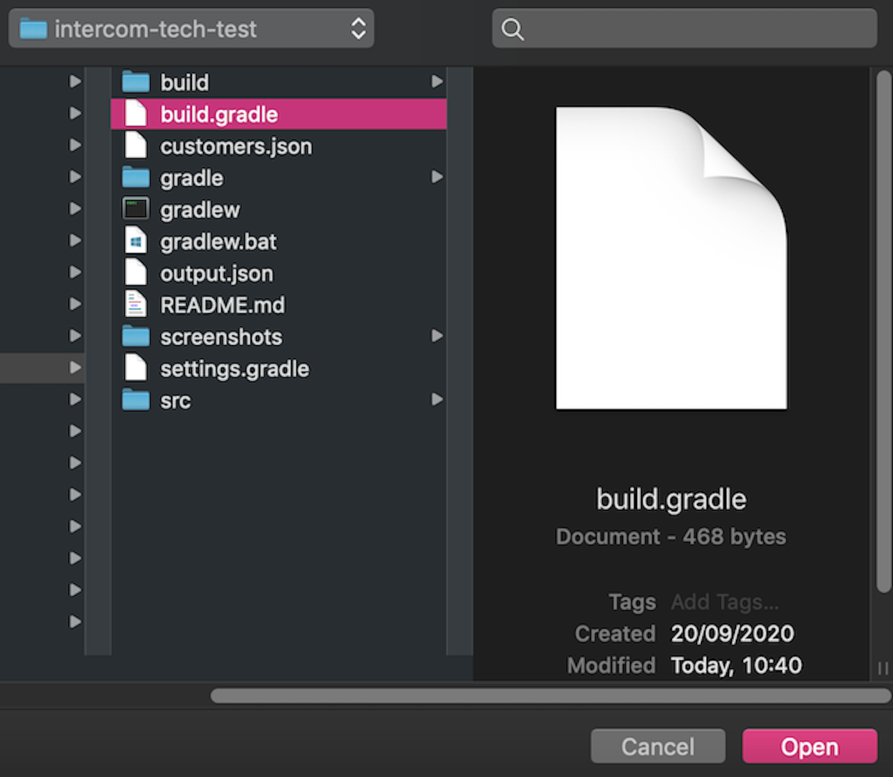
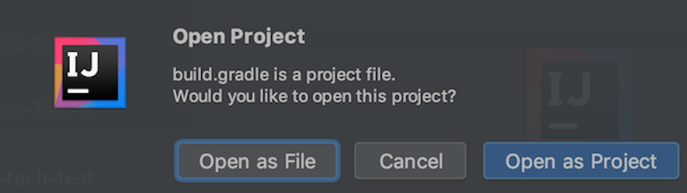

# Intercom-Tech-Test

## Index

1. [Instructions](#instructions-for-the-tech-test)
2. [Installation](#installation)
3. [How to execute the code](#how-to-execute-the-code)
4. [How to improve the code](#how-to-improve-the-code)
5. [How to run the unit tests](#how-to-run-the-unit-tests)
6. [Output file](#output-file)
7. [Proudest achievement to date](#proudest-achievement-to-date)

## Instructions for the tech test

We have some customer records in a text file (customers.txt) -- one customer per line, JSON lines formatted. We want to invite any customer within 100km of our Dublin office for some food and drinks on us. 
Write a program that will read the full list of customers and output the names and user ids of matching customers (within 100km), sorted by User ID (ascending).

* You must use the first formula from [this Wikipedia][1] article to calculate distance. Don't forget, you'll need to convert degrees to radians.

* The GPS coordinates for our Dublin office are 53.339428, -6.257664.

* You can find the Customer list [here][2].

We're looking for you to produce working code, with enough room to demonstrate how to structure components in a small program. Good submissions are well composed. Calculating distances and reading from a file are separate concerns. Classes or functions have clearly defined responsibilities. 

Poor submissions will be in the form of one big function. It’s impossible to test anything smaller than the entire operation of the program, including reading from the input file.

## Installation

Recommended IDE: Intellij

After cloning the project you will need to open the project in an IDE. Please do so by opening the build.gradle file.

Then you will need to open it as a project which will enable the IDE to determine the correct file structure, 
download necessary dependencies, etc.

## How to execute the code
The code can be executed by navigating to src/main/java/com/mycompany/myapp/Filter.java and opening the file in an IDE.

Then you will need to click the run button and click on run filter main which will execute the code for printing out the json
as highlighted in the screenshot below.

The output highlighted above is also shown more clearly by navigating to the [output](#output-file) file.

Alternatively you can always play around and write your own code to see the output. For example `filter.usersWithin100Km` will return an unordered list of users within 100 km.

Additionally, you can do the following in the main method `System.out.println(CalculateDistance.usingGivenFormula("userLat", "userLong"));` where userLat and userLong can be replaced with
any latitude and longitude and so you can check the distance between the dublin office and anywhere in the world. 

## How to improve the code
I have tried to write the code so that it is scalable and thus an improvement could be is to have more parameters in the `CalculateDistance.usingGivenFormula("userLat", "userLong")` so it becomes `CalculateDistance.usingGivenFormula("myLocationLat", "myLocationLong", "userLat", "userLong")` which could replace the presets for the dublin office and then the program would be able to calculate the distance between any 2 locations.

Furthermore, if we wanted to increase the distance to see if people are for example within the 300 km radius then changes to the code are easy enough and if this was
used more frequently then we could parameterise the distance and thus would be more flexible. The reason I haven't done it here is because it is unnecessary since the 
function only ever needs to calculate for 100 km. 

Moreover, a different (more accurate) formula could be used to calculate Great-circle distance such as the haversine formula or vincenty formula.  

## How to run the unit tests
### For all of the following operations please make sure you have JDK 8 installed and gradle version 5 or above

There are 2 ways to be able to run the test:
1. Run ./gradlew clean test in the terminal - alternatively running ./gradlew clean test --info will give a more verbose answer and this especially use if the tests fail
2. Opening either of the test classes in an IDE such as Intellij and click the run button

There are 3 different test files and clicking run in either of them will run the tests associated, but to run all of them we can just use method 1.

If the tests do fail the error message from using the info command is quite helpful as depicted in the screenshot below (intentionally failed to show output)

## Output file

The output file is in the root directory and is in the form of a json instead of a txt as it is better suited to display the information.
This output of this file can also be retrieved by running the main method in the Filter class and checking the output which is displayed as a json array
where the users, and their ids within 100 km are sorted in ascending order.

## Proudest achievement to date

Apart from the beauty that is this readme?...That would have to be completing Makers Academy and solidifying my transition into software development.
I am thrilled that I was able to take the future into my own hands and refused to let myself hate 5 out of 7 days in my life.
It was certainly a turning point for me, and I want to use this opportunity now to work as hard as possible towards my dream of 
becoming a successful developer.

Only kidding about the readme ;)

[1]: https://en.wikipedia.org/wiki/Great-circle_distance
[2]: https://s3.amazonaws.com/intercom-take-home-test/customers.txt#